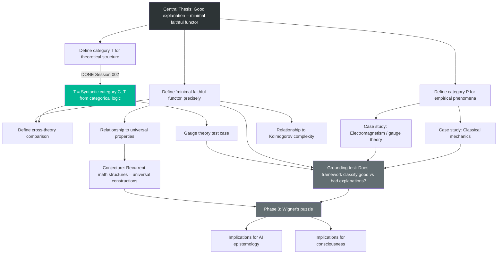

# Conceptual Map

This document tracks the dependency structure of the research. It answers: what depends on what, what's blocked, and where independent tracks exist.

Update this every session during closing protocol. When the structure changes — a new question opens, a dependency is discovered, a result unblocks something — revise accordingly.

## Research Structure (Mermaid)

**Legend:** Green = resolved. Dark gray = milestone. Medium gray = distant.

## Track Status

### Track 1: Foundations (Active — partially resolved)

Define P, T, and the explanatory functor. Currently the critical path.

- **Status:** T is resolved (syntactic category, Session 002). Functor direction resolved (T → P, Session 002). **P is the remaining critical gap.** Cross-theory comparison is a new open problem.
- **Blocked by:** Nothing — P construction is the active front.
- **Unlocks:** Case studies, grounding tests, everything downstream.

### Track 2: Case Studies (Active — first study complete)

Apply framework to classical mechanics, electromagnetism, and historical examples.

- **Status:** Ptolemy-vs-Kepler case study completed (Session 003, informal). Framework produces correct, non-trivial verdict. Gauge theory test (Session 002, informal) also supporting. Next: formalize the Ptolemy-vs-Kepler case, then test Maxwell's unification or Newton-vs-Kepler.
- **Blocked by:** Formalization of P and T categories for the case studies. Minimality definition still needed for full classification.
- **Unlocks:** Grounding tests, framework validation, confidence in C-001.

### Track 3: Wigner's Puzzle (Waiting)

Connect explanatory framework to universality in category theory.

- **Status:** Waiting on Tracks 1 and 2.
- **Blocked by:** Validated framework + universal properties analysis.
- **Unlocks:** The central result.

### Track 4: Implications (Waiting)

AI epistemology, consciousness, foundations of mathematics.

- **Status:** Distant — do not start until Track 3 has results.
- **Blocked by:** Everything else.

## Notes on Dependencies

- Tracks 1 and 2 have a soft dependency: you can start sketching case studies before definitions are final, as a way of testing whether the definitions are on the right track. But don't formalize case study results until definitions stabilize.
- The relationship between minimality and Kolmogorov complexity (node G) may turn out to be a dead end. If so, an alternative notion of minimality needs to be found before Track 3 can proceed.
- **New (Session 002):** The syntactic category connection means Track 1 is now partially about understanding existing literature (Lawvere, Makkai-Reyes) rather than inventing new machinery. This is good — we should know what already exists before claiming novelty.
- **New (Session 002):** Cross-theory comparison (node O) is a new dependency that was not in the original scoping document. It sits between Tracks 1 and 2 — we need it to compare explanations, which is what the grounding tests require.

---

_Last structural revision: Session 003. Update this header when you modify the graph._
