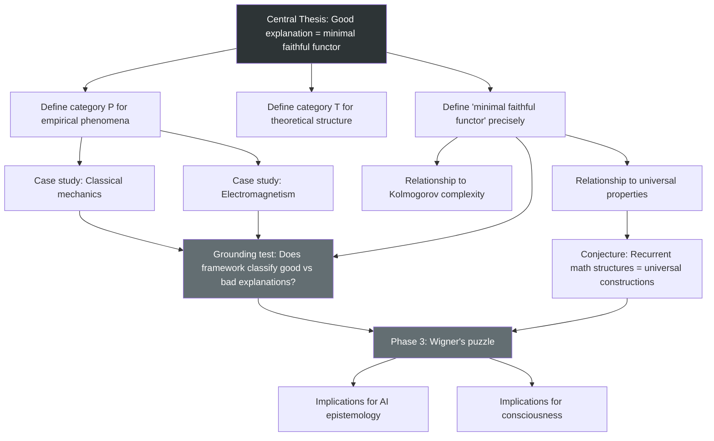

# Conceptual Map

This document tracks the dependency structure of the research. It answers: what depends on what, what's blocked, and where independent tracks exist.

Update this every session during closing protocol. When the structure changes — a new question opens, a dependency is discovered, a result unblocks something — revise accordingly.

## Research Structure (Mermaid)

## Track Status

### Track 1: Foundations (Active)

Define P, T, and the explanatory functor. Currently the critical path.

- **Status:** Not started
- **Blocked by:** Nothing — this is where we begin
- **Unlocks:** Case studies, grounding tests, everything downstream

### Track 2: Case Studies (Waiting)

Apply framework to classical mechanics, electromagnetism, and historical examples.

- **Status:** Waiting on Track 1
- **Blocked by:** Rigorous definitions of P, T, and minimality
- **Unlocks:** Grounding tests, framework validation

### Track 3: Wigner's Puzzle (Waiting)

Connect explanatory framework to universality in category theory.

- **Status:** Waiting on Tracks 1 and 2
- **Blocked by:** Validated framework + universal properties analysis
- **Unlocks:** The central result

### Track 4: Implications (Waiting)

AI epistemology, consciousness, foundations of mathematics.

- **Status:** Distant — do not start until Track 3 has results
- **Blocked by:** Everything else

## Notes on Dependencies

- Tracks 1 and 2 have a soft dependency: you can start sketching case studies before definitions are final, as a way of testing whether the definitions are on the right track. But don't formalize case study results until definitions stabilize.
- The relationship between minimality and Kolmogorov complexity (node G) may turn out to be a dead end. If so, an alternative notion of minimality needs to be found before Track 3 can proceed.

---

_Last structural revision: Session [___]. Update this header when you modify the graph._